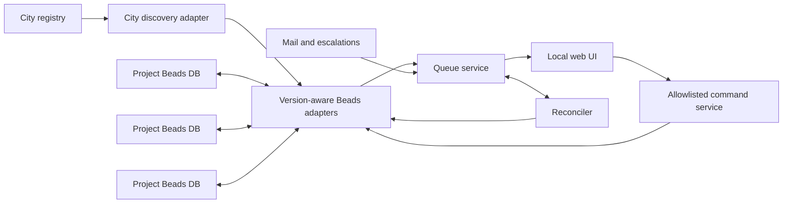

# Beads Operator-Judgment Queue Design

**Date:** 2026-08-16

**Status:** Approved in conversation; awaiting written-spec review

**Tracking bead:** `hq-09n4l3`

**Working product name:** Beaddash

## Summary

Beaddash is a focused, local operator console for decisions that automation
cannot or should not make alone. It gathers decision requests from every
registered project in one city, explains the request and its consequences,
records the operator's judgment durably in Beads, and signals any waiting
workflow.

It is not a general-purpose Beads dashboard. It does not edit arbitrary work,
choose on the operator's behalf, or execute the deployment, deletion,
purchase, permission change, or other operation being approved.

The central product invariant is:

> The decision survives the requesting agent.

The canonical answer is a Beads record in the same project database as the
source bead. Agent mail, live sessions, UI caches, and the dashboard process
are delivery mechanisms, not sources of truth.

## Context and local findings

The design was prompted by a screenshot of an unpublished prototype named
"beaddash." The prototype showed global ask and unread counts, one prominent
decision card, explicit authorize/deny actions, an operator comment, a thread
inbox, refresh, and a link to the broader Beads interface.

Local capability inspection found several relevant but separate mechanisms:

- `bd human list` finds ordinary issues labeled `human`.
- `bd human respond` adds a response comment and closes the issue with reason
  `Responded`; `bd human dismiss` closes it with reason `Dismissed`.
- Human gates are separate gate beads. They block work until manually
  resolved, but they do not store an approve/deny outcome.
- `decision` is an existing issue type intended for architectural decision
  records, not transient operator requests.
- Beads supplies labels, comments, metadata, relationships, assignment,
  priority, closure, and Dolt-backed history.
- Gas Town mail is bead-backed and supplies sender, recipient, thread,
  read/unread state, priority, delivery acknowledgement, and replies.
- Gas Town escalations supply severity routing, source, related-bead context,
  fingerprint-based duplicate suppression, acknowledgement, stale handling,
  and closure.

The installed `bd` is version 1.1.0, while the inspected Gas Town release
rejects versions newer than 1.0.5 for some commands. That mismatch is concrete
evidence that the console needs a version-aware adapter boundary and must not
couple directly to one internal database schema.

The Beads project charter also places orchestration policy outside Beads core
and recommends namespaced issue metadata before schema expansion. Gas City's
architecture likewise treats Beads as the universal persistence substrate and
events or mail as outbound delivery. This design follows those boundaries.

## Goals

The MVP must:

- Present every valid open decision request from registered projects in one
  city.
- Explain urgency, risk, affected systems, blast radius, provenance, and the
  exact question before asking for judgment.
- Record approve, deny, request-changes, defer, reassign, and read-state
  actions durably in Beads.
- Work even if the requesting agent exited, changed projects, or never returns.
- Preserve a human-readable answer and machine-readable outcome.
- Release a linked gate only after the canonical decision is durable.
- Keep incomplete follow-up delivery visible and retryable.
- Isolate unhealthy or incompatible projects from healthy ones.
- Provide a separate bead-backed message inbox.
- Remain reconstructable from project Beads databases with no authoritative
  application database.

## Non-goals

The MVP will not:

- Execute the operation being approved.
- Become a general-purpose Beads browser or editor.
- Add decision-request policy or schema to Beads core.
- Replace Beads mail or Gas Town escalation systems.
- Aggregate multiple cities.
- Support remote multi-user hosting.
- Use fuzzy or AI-based deduplication.
- Provide a policy-authoring UI.
- Provide analytics beyond actionable counts and filters.
- Depend on a particular configured agent role.

## Product decisions

| Question | Decision |
| --- | --- |
| Read or write | Constrained read/write console for decision lifecycle only |
| Request representation | Separate decision bead linked to the source bead |
| Direct execution | Record and signal the answer; never execute the underlying operation |
| Deployment scope | One local city, all registered projects/rigs |
| Lifecycle | Pending or undated deferred, then a terminal outcome |
| Source of truth | Decision bead metadata, comments, relationships, and Dolt history |
| Architecture | External local console using version-aware CLI adapters |

## Primary users and use cases

The primary user is the human operator responsible for a local city. Requesters
may be any configured agent or automation process; the design never hardcodes
role names.

Typical requests include:

- Destructive or disruptive operations
- Ambiguous requirements
- Security or permission decisions
- Scope and priority tradeoffs
- Failed automation requiring a choice
- Deployment or release approval
- Financial or external-service actions
- Direct agent questions
- Stale work awaiting human input

## Architecture

Beaddash is a standalone orchestration companion, not a Beads core feature or
a Gas City SDK primitive. Its source should live in a dedicated repository.
This proposal lives in the Gas City documentation tree because Gas City owns
the local city and project-discovery contract that the companion consumes.

The MVP ships as one Go binary with embedded web assets. It binds to loopback,
opens the operator's browser, and uses server-rendered HTML with small
progressive JavaScript enhancements. It does not require a SPA framework,
Electron, Node at runtime, or a second database.



### Components

**City discovery adapter**

Accepts one configured city root and enumerates its registered projects. It
uses the city's supported discovery contract rather than guessing arbitrary
filesystem paths. The result includes stable project identity, display name,
working directory, and health.

**Version-aware Beads adapter**

Detects the usable `bd` version and capabilities for each project, executes
JSON CLI commands with an explicit project directory, and maps results into a
stable internal model. It never reads Dolt tables directly. Adapter capability
negotiation distinguishes readable, writable, and unsupported projects.

**Queue service**

Aggregates decision records, enriches them with source-bead context, groups
exact duplicates, computes ordering and counts, and exposes one normalized
view to the UI. It contains lifecycle rules but no judgment about whether an
operation should be approved.

**Command service**

Accepts only the product's lifecycle actions and translates them into fixed,
allowlisted Beads commands. It never accepts an arbitrary executable, command
line, project path, or metadata key from the browser.

**Reconciler**

Refreshes project state, retries incomplete post-decision delivery, and closes
objectively obsolete requests. It is idempotent and does not depend on the
requesting agent being alive.

**Web UI**

Renders the focused queue and separate inbox, submits lifecycle commands, and
provides validated deep links to source beads, transcripts, logs, and diffs.

## Canonical decision record

Each structured request is an ordinary `task` bead in the same project
database as its source. It has these labels:

- `human`
- `decision-request`
- Exactly one of `unread` or `read`

The decision and source use a bidirectional `relates-to` relationship. A
revised request creates a new decision whose `supersedes` relationship points
to the earlier decision. The existing `decision` issue type remains reserved
for architectural decision records.

The title is a concise decision summary. The description contains the exact
question, rationale, and consequences. Comments contain discussion and the
final human-readable response. Beads priority is urgency; risk is distinct.

### Metadata contract

Structured fields live under the `operator_decision` metadata namespace.
Writers must preserve unknown keys for forward compatibility.

Required while open:

| Field | Type | Meaning |
| --- | --- | --- |
| `schema_version` | integer | Contract version; initially `1` |
| `queue_state` | enum | `pending` or `deferred` |
| `request_type` | enum | Kind of human judgment requested |
| `risk` | enum | `low`, `medium`, `high`, or `critical` |
| `source.project` | string | Stable city project identity |
| `source.bead_id` | string | Source bead ID |
| `requester.actor` | string | Agent or automation identity |
| `dedupe_key` | string | Stable exact-match key within the project |
| `comment_policy` | enum | `optional` or `required`; built-in safety rules may elevate it to required |
| `affected_systems` | string array | Systems affected by the proposed operation |
| `blast_radius` | string | Short consequence summary |

Optional while open:

| Field | Type | Meaning |
| --- | --- | --- |
| `requester.session_id` | string | Requesting session identity |
| `requester.run_id` | string | Requesting run identity |
| `gate_id` | string | Human gate to release after recording the answer |
| `links.transcript` | string | Validated transcript reference |
| `links.logs` | string | Validated logs reference |
| `links.diff` | string | Validated diff reference |

A terminal record additionally requires:

| Field | Type | Meaning |
| --- | --- | --- |
| `resolution.outcome` | enum | `approved`, `denied`, `changes_requested`, `withdrawn`, or `obsolete` |
| `resolution.operator` | string | Human operator identity |
| `resolution.at` | RFC 3339 timestamp | Time the outcome became canonical |
| `resolution.operation_id` | string | Idempotency key for the action |
| `resolution.comment` | string | Operator response; empty only when policy permits |
| `delivery.*.state` | enum | `pending`, `complete`, `failed`, or `not_applicable` |
| `delivery.*.last_error` | string | Present only after a failed delivery attempt |

Delivery members are `decision_comment`, `source_annotation`, `gate_release`,
and `notification`.

Example open metadata:

```json
{
  "operator_decision": {
    "schema_version": 1,
    "queue_state": "pending",
    "request_type": "destructive_operation",
    "risk": "high",
    "source": {
      "project": "gastown",
      "bead_id": "gt-abcd"
    },
    "requester": {
      "actor": "gastown/worker-7",
      "session_id": "session-123"
    },
    "dedupe_key": "gastown:gt-abcd:control-plane-reboot",
    "comment_policy": "required",
    "affected_systems": ["beads", "agent sessions", "control plane"],
    "blast_radius": "All city agents and the control plane stop for several minutes.",
    "gate_id": "gt-gate-123",
    "links": {
      "transcript": "session:session-123",
      "logs": "log:control-plane/reboot-check",
      "diff": "git:abc1234"
    }
  }
}
```

## Lifecycle

The stored bead status and metadata jointly define lifecycle:

| Bead status | Queue state | Meaning |
| --- | --- | --- |
| `open` | `pending` | Unresolved and actionable |
| `open` | `deferred` | Unresolved, visible, sorted below pending |
| `closed` | absent or previous value | Terminal; outcome is in `resolution` |

Defer is intentionally undated. It does not use native `bd defer`, does not
hide the request, and does not return automatically. Restore changes
`queue_state` to `pending`.

Reassignment changes the Beads assignee. Read/unread changes labels. Neither
changes lifecycle.

`changes_requested` is terminal for the current wording. A revised ask is a
new decision bead linked with `supersedes`; this preserves what the operator
actually reviewed.

The requester exiting or switching projects never resolves a decision.

## Discovery and normalization

On refresh, the service:

1. Enumerates registered projects.
2. Negotiates read/write capabilities per project.
3. Queries projects concurrently with bounded timeouts.
4. Loads open structured decisions and their source beads.
5. Normalizes compatible legacy inputs.
6. Loads the operator inbox separately.
7. Groups exact duplicates and sorts the queue.

### Legacy inputs

An ordinary `human` bead without the structured metadata appears as a legacy
ask. Promoting it creates a separate structured decision bead related to that
legacy bead; the original is not silently repurposed.

A human gate without a decision appears as an incomplete ask. Promotion
creates a decision whose source is the bead blocked by the gate and whose
`gate_id` references the gate. The gate cannot itself store an outcome.

Mail and escalations remain inbox records. "Promote to decision" creates a
structured decision related to the message or its explicitly related source
bead. The promotion form visibly pre-fills escalation severity as follows:
critical to P0/critical risk, high to P1/high, medium to P2/medium, and low to
P3/low. The operator may change those values before creating the decision.

## Deduplication

Deduplication is exact and deterministic.

- The primary key is `(project, dedupe_key)`.
- If a producer omits `dedupe_key`, the compatibility adapter derives one
  from project, source bead, and request type.
- Fuzzy title or description similarity is never used in the MVP.
- Records are never deleted or physically merged.

Matching open records render as one group with every requester, timestamp,
and provenance item visible. A group action explicitly states how many
records it affects and applies the same outcome to each member. Member-level
results remain visible if a batch is partially successful. The operator can
expand the group and act on one member when the records should diverge.

## Queue order and filters

The default order is:

1. Pending before deferred
2. Beads priority from P0 through P4
3. Risk from critical through low
4. Oldest request first

Age is displayed prominently so stale requests are visible. Deferred groups
occupy a collapsed section at the bottom and preserve the same internal sort.

Filters include project, agent, request type, risk, priority, age, assignee,
and unread state. Filtering never mutates canonical records.

## Actions and write protocol

Allowed actions are:

- Approve
- Deny
- Request changes
- Defer
- Restore to pending
- Reassign
- Add comment
- Mark read or unread
- Promote a legacy bead, bare gate, message, or escalation to a decision

Terminal actions do not execute the proposed operation.

### Operator-owned single-writer contract

A bead labeled `decision-request` is operator-owned lifecycle state. Beaddash
may mutate it on behalf of the current operator, and a human operator may use
equivalent direct `bd` commands while Beaddash is stopped. Agents and other
automation may read the decision and add comments, but they must not change its
status, lifecycle labels, assignee, or `operator_decision` metadata. Source
beads remain ordinary collaborative records.

At most one Beaddash process may have lifecycle-write access to a given project
at a time. One Beaddash process may cover multiple projects, but two processes
must not be configured as writers for the same project.

Before a direct lifecycle edit, the operator stops every Beaddash process that
can reach the project. After the edit, the operator restarts Beaddash; its
startup refresh loads the direct change as the new observed state. Concurrent
raw `bd` lifecycle mutation while Beaddash is running is outside the supported
contract.

Observed timestamps, in-process serialization, operation IDs, and canonical
post-write verification remain defense in depth for stale tabs, duplicate
submissions, and multiple Beaddash actions. They are not cross-process
compare-and-set. If post-write verification does not match the requested
operation, Beaddash reports a visible conflict, stops follow-up delivery, and
does not retry or overwrite again.

### Idempotent terminal write

The browser submits a decision ID, project identity, desired outcome, comment,
observed update timestamp, and unique operation ID.

The command service:

1. Resolves the project from the allowlisted city registry.
2. Re-reads the decision and source.
3. Rejects a closed record, invalid transition, stale observed timestamp, or
   missing required comment.
4. Serializes in-process writes for that decision.
5. Uses one supported `bd update` invocation to persist resolution metadata,
   initialize delivery state, attribute the actor, and close the decision.
6. Re-reads and verifies the canonical outcome.
7. Performs follow-up delivery in order.

Follow-up delivery is:

1. Add the final human-readable comment to the decision.
2. Add a concise outcome and decision link to the source bead.
3. Resolve the linked human gate.
4. Send a structured notification or reply when a valid recipient exists.

The canonical outcome is never rolled back because a follow-up step failed.
The failed step remains visible with its last error and is retried by the
reconciler. A repeated operation ID returns the previously recorded result.

The service re-reads after writes to verify the canonical result and to detect
violations of the single-writer convention. A mismatch is surfaced for manual
review and stops delivery. Beaddash does not claim that this re-read prevents a
noncompliant concurrent CLI writer from overwriting state.

## Automatic obsolescence

The reconciler may close an open decision with outcome `obsolete` only when
objective evidence exists:

- The source bead is closed.
- The source bead is superseded.
- The linked human gate was independently resolved.

The resolution comment records which condition triggered obsolescence. An
unreachable source, missing requester session, old age, or absent notification
recipient is insufficient.

## Operator experience

### Header

The header shows product name, pending-decision count, unread-message count,
last refresh, degraded-project warnings, refresh control, and a link to the
broader Beads interface.

### Focused decision

One selected decision is prominent. It shows:

- Priority, risk, project, bead ID, age, request type, and assignee
- Title and expandable source description
- Collapsible notes and decision history
- A visually explicit "agent asks" section
- Affected systems and blast radius
- Requester and run/session provenance
- Deduplicated requesters and member count
- Validated source bead, transcript, log, and diff links

Primary controls are Approve, Deny, Request Changes, and Defer. Reassign and
restore are secondary controls. The comment field states whether a response
is required. Approval copy states that the console records authorization but
does not perform the operation.

The remaining queue uses compact cards beside or below the selected record,
depending on viewport width. Completing an action selects the next pending
decision.

### Inbox

The separate inbox shows sender, unread count, subject, preview, timestamp,
priority, and message type. Actionable messages offer "Promote to decision."
Reading mail does not resolve a decision.

### Accessibility

All actions support keyboard navigation. Status and risk never rely on color
alone. Focus order, control labels, confirmation dialogs, and live status
updates must be accessible to screen readers.

## Security

- Bind only to loopback by default.
- Generate a per-launch authentication token.
- Enforce strict Origin checks and CSRF protection.
- Use SameSite cookies when browser sessions are used.
- Spawn fixed binaries with argument arrays; never invoke a shell.
- Allowlist commands, flags, metadata namespaces, project roots, and deep-link
  schemes.
- Pass the configured operator identity through `bd --actor`.
- Sanitize rendered Markdown and externalized error text.
- Never expose stored credentials or arbitrary local files.
- Require a comment for Deny and Request Changes.
- Require explicit confirmation and a comment for Approve when risk is high or
  critical, regardless of a producer's `comment_policy` value.
- Do not expose an arbitrary command runner or an endpoint for the underlying
  approved operation.

The browser cannot supply a filesystem project path. It supplies a stable
project ID, which the server resolves through the discovered allowlist.

## Failure handling

Project failures are isolated. A failed refresh or write in one project does
not block healthy projects.

Project health states are:

- `healthy_read_write`
- `healthy_read_only`
- `unreachable`
- `unsupported`

Read-only, unreachable, and unsupported projects display a reason and disable
mutations. A cached view exists only for the lifetime of the process and is
visibly marked stale; it is never authoritative.

Errors are never converted into empty successful results. The UI reports the
affected project or delivery step, while logs retain command, adapter, timing,
exit status, and redacted diagnostic context.

## Observability

The process emits structured local logs for:

- Refresh start, finish, duration, and per-project result
- Adapter and capability selection
- Decision transitions and operation IDs
- Reconciliation attempts and delivery results
- Authentication, origin, and validation failures

Logs contain IDs and state transitions but redact comments, credentials, and
potentially sensitive source descriptions by default.

The UI exposes current project health and pending delivery failures. Metrics
or remote telemetry are not required for the MVP.

## Testing strategy

No test may mutate a production Beads database.

### Unit tests

- Metadata schema validation and forward-compatible unknown fields
- Lifecycle transitions and comment policy
- Queue ordering and deferred placement
- Exact deduplication and group actions
- Read/unread normalization
- Legacy input normalization
- Auto-obsolescence evidence rules
- Adapter capability selection
- Command argument construction and allowlists

### CLI contract tests

Run against each supported `bd` version using isolated temporary Beads
databases. Cover list, show, metadata update, relationship, comment, close,
label, assignment, gate, and history behavior. Preserve representative JSON
fixtures to detect output-shape drift.

The initial compatibility target includes the locally observed 1.0.5 and
1.1.0 behaviors. A version is write-supported only after its contract suite
passes; otherwise it is read-only or unsupported.

### Integration tests

Use temporary city and project directories to cover:

- Aggregation across multiple projects
- A requester that no longer has a live session
- Legacy bead, gate, and message promotion
- Gate release after canonical decision persistence
- Source annotation and notification failure with later retry
- Restart recovery from pending delivery metadata
- Duplicate operation submission
- Exact duplicate groups and partial member failure
- A stale browser submission after an observed direct operator mutation
- Restart and refresh after a direct operator mutation made while Beaddash was
  stopped
- A post-write verification mismatch that becomes visible and stops delivery
- Independently closed sources and gates
- One unreachable project among healthy projects
- Unsupported writer fallback to read-only

### Browser and accessibility tests

- Primary and secondary actions
- Required-comment enforcement
- High-risk confirmation
- Filter and sorting behavior
- Deferred section placement and restore
- Inbox read state and promotion
- Visible operator-ownership and stop-before-direct-write guidance
- Keyboard-only operation
- Screen-reader names, focus movement, and non-color status cues

### Security tests

- Loopback binding
- Per-launch authentication
- CSRF and Origin rejection
- Project-path substitution rejection
- Shell metacharacter handling
- Markdown sanitization
- Deep-link scheme and path validation
- Redaction of subprocess errors and logs

## MVP acceptance criteria

The MVP is complete when all of the following are demonstrated in isolated
test projects:

1. Every valid open decision in registered projects appears after refresh.
2. Pending and deferred ordering matches the specified rules.
3. The operator can approve, deny, request changes, defer, restore, reassign,
   comment, and change read state.
4. The canonical outcome remains queryable through `bd` after the dashboard
   stops and the requesting agent is absent.
5. A linked gate is never released before the outcome is durable.
6. Failed follow-up delivery remains visible and converges after retry.
7. Within the operator-owned single-writer contract, stale or duplicate
   Beaddash submissions cannot create conflicting outcomes; a post-write
   verification mismatch is visible and stops delivery.
8. An unhealthy project cannot block healthy projects.
9. Legacy human beads, bare human gates, and inbox messages can be promoted to
   structured decisions.
10. The product contains no path that executes the underlying approved
    operation.
11. Supported-version contract, integration, browser, accessibility, and
    security tests pass.

## Future extensions

The following may be considered after the MVP validates the record contract:

- A native Beads decision-request command if transactional lifecycle support
  proves broadly useful without importing orchestration policy into core
- Event-driven refresh instead of periodic and manual refresh
- Cross-city aggregation with explicit identity and conflict rules
- Configurable policy files defining which producer operations require human
  approval
- Notification connectors outside Beads mail
- Fuzzy duplicate suggestions that never merge automatically
- Historical throughput and aging reports

None of these is required by the initial implementation plan.
